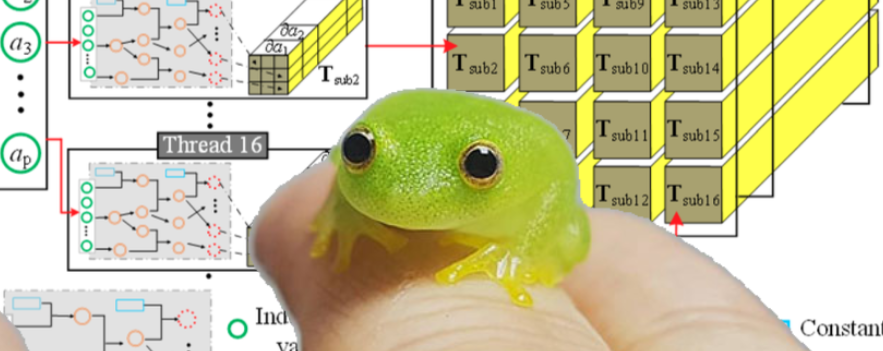

# weenygrad



A miniscule vectorized autograd engine that implements backpropagation (reverse mode AD). Extended from [micrograd](https://github.com/karpathy/micrograd/tree/master) to support the bare minimum vector operations to train a neural networks. Debateably useful for educational purposes.

# Installation

```
git clone https://github.com/spikedoanz/weenygrad
pip install numpy
```

# Example usage

```
# normal math
import numpy 
from weenygrad import ADVect

x = ADVect([-4.0])
z = [2.0] @ x + [2.0] + x
q = z.relu() + z @ x
h = (z @ z).relu()
y = q @ x
y.backward()

# x.grad should equal 128
```

# Training neural nets


The notebook binary_classifier.ipynb provides an example of a 2 layer feed forward network. I was too lazy to implement regularization so excuse the jagged category boundaries.


# Tests

You'll need [torch](https://pytorch.org/). To run tests, simply do:

```
python weenygrad_tests.py
```
